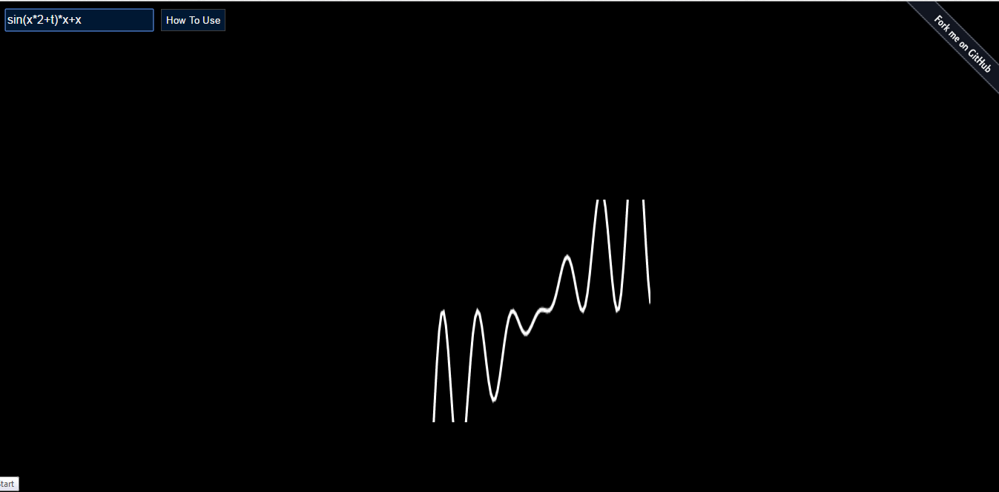

# Graph Calculator using HTML5
This web application helps you to find the curve of any mathematical equation and expression. The project was done when I was learning how to use Canvas in HTML5 and Math.js Library.

 

 

<h2>Learning</h2>
Keys I learnt from the screencast and while building this project:

<ul>
<li>Creating and using canvas element</li>
<li>Drawing wave path of any curve from basic sine wave to complicated consisting many lines</li>
<li>Transforming between math cordinate and pixel cordinate</li>

<li>Animation with <a href="http://www.paulirish.com/2011/requestanimationframe-for-smart-animating/" target="_blank">requestAnimationFrame</a></li>

<li>Using <a href="http://mathjs.org/" target="_blank">Math.js</a> to evaluate mathematical expressions</li>

<li>Plotting a Math.js expression</li>
<li>Using the URL hash fragment to store and share plots</li>

</ul>

<h2>Demo</h2>

Run the <a target="_blank" href="http://abhishekraj.info/apps/Graphical">Demo</a>

